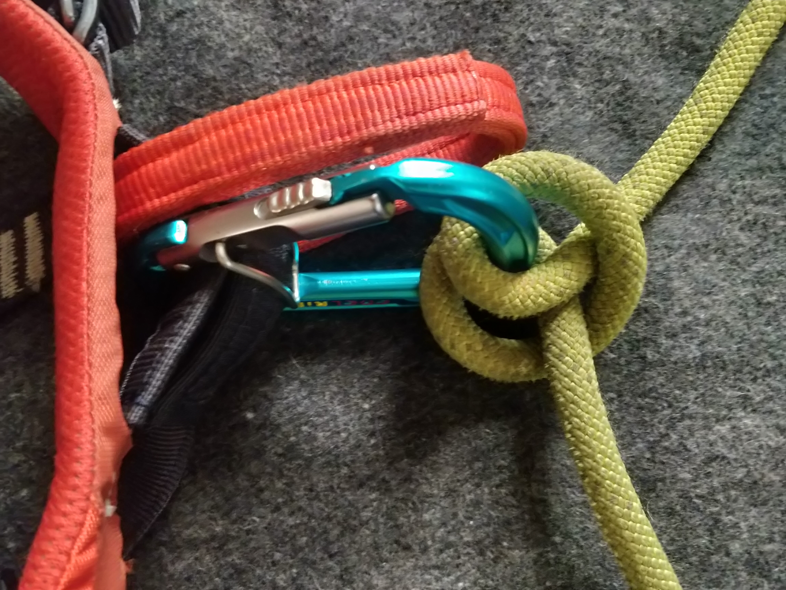

# Bowline with a Bight for tying in to the middle of a line

When climbing it's common to need to "tie in", or attach yourself to a rope line.
Typically you tie in to one of the ends of the line, and there are well established ways of doing this.
However, sometimes it's necessary to tie into the middle of the line. 
<!-- more -->
When simul climbing, for example. 
Practices around tying into the middle of a line are less established than tying in to the end. Here we'll cover some of the different knots used as well as go into detail on one which is arguably the best, the bowline with a bight.

## Figure-eight on a bight

When tying in to the end of a line the figure-eight loop (ABoK#1047) [tied with a follow-through](https://www.animatedknots.com/figure-8-follow-through-loop-knot) is used almost universally thanks to its strength and ease of inspection. 
Given the ubiquity of the figure-eight, it's not surprising that climbers use it for tying in to the middle of the line as well as the end. 
However, since the standing end of the line isn't available, the figure-eight needs to be tied on a bight and attached to the harness with a carabiner. 
Unfortunately the addition of the carabiner causes some problems. The carabiner is typically weaker than the figure-eight, so the advantage of the figure-eight's strength is removed. 
The carabiner also needs to have some mechanism to prevent cross-loading, since the minor axis strength is usually less than half of the [strength of a correctly oriented carabiner](https://www.petzl.com/US/en/Sport/Examples-of-dangerous-carabiner-loading-). 
A carabiner also needs a locking mechanism, and the climber needs to ensure they don't forget to engage the lock.

## Alpine butterfly

The alpine butterfly (ABoK#1053) is another knot commonly used to tie into the middle of a line. 
It's not as strong as the figure-eight, but it's easier to tie with gloves on, easier to untie, and it just looks friggin awesome. 
Unfortunately it shares all the disadvantages that come with the inclusion of the carabiner.

## Clove hitch

The clove hitch (ABoK#1245) is wicked [fast to tie](https://www.animatedknots.com/clove-hitch-knot-using-loops), and can also be tied on a carabiner with one hand. 
When loosened, it's easy to adjust the position on the line.
The knot unties itself when removed from the carabiner, which can be useful for escaping a loaded line.

## Bowline with a bight

Arguably the best way to tie into the middle of a line is with the bowline with a bight. The name of this knot is something of a vagary.
"Mountaineering: The Freedom of the Hills" (8th ed.) calls this a double bowline, however that name typically refers to a different knot (ABoK#1013).
It also should not be confused with the bowline *on* a bight (ABoK#1080). Ultimately the name bowline *with* a bight came from consensus on [r/knots](https://old.reddit.com/r/knots/comments/frz6ef/id_this_knot).   
The great thing about this method of tying in is that although it uses a carabiner, the carabiner is not load bearing. 
So a smaller carabiner can be used and it doesn't need to have a mechanism to prevent cross-loading.
It is also strong, yet very easy to untie.

Since this is the knot we prefer, let's learn to tie it. 
Essentially the knot is made the same way as a normal bowline (ABoK#1010), but with a bight, rather than the standing end of the rope. 
Therefore it may be useful to learn [how to tie the normal bowline](https://www.animatedknots.com/bowline-knot) first.

### Tying a bowline with a bight

1. take a bight of rope

2. make an open loop

3. make a loop on the standing ends

4. pass the working bight through the loop

5. wrap the working bight around the standing ends

6. pass the working bight back through the loop

7. tighten and dress the knot

### Tying a bowline with a bight to a harness

1. instead of making an open loop, pass the bight through the tie in loops

2. make the knot

3. clip the bight to the belay loop

4. climb!

### The cowboy or left-hand bowline

The meticulous reader might have noticed that our step by step knot and our knot on the harness aren't quite the same. 
The working bight ended up on the inside of the loop on one, and outside the loop on the other.

This latter form is called the cowboy or left-hand variant. It doesn't matter which you tie. Just pull the belay loop through the bowline loop to be on the same side as the bight to keep things tidy.