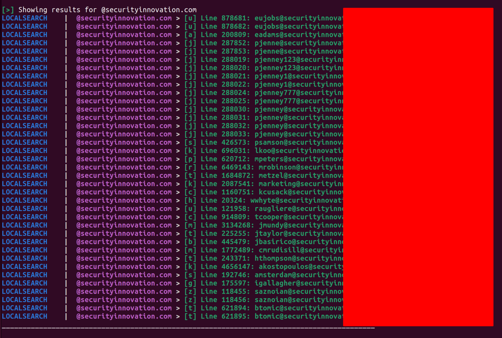

# Modern Breach Hunting for Red Team Applications


Breach hunting has in recent years been a primary attack vector for malicious hackers to obtain a foothold on corporate networks. Gone (mostly) are the days of finding SQL injection on a company’s customer-facing web resources, popping open an XP_CMDSHELL, and proxychaining your way to the DC. Now even non-technically-savvy organizations are able to leverage The Cloud and COTS solutions that preclude a lot of the easy initial attack vectors that many of us grew up with.
<!-- more -->

However, no amount of the latest patched VPN solutions, bastion servers, diligent access logging, etc can entirely prevent the oldest attack vector primitive: people making mistakes. This article will go in-depth examining one of the easiest (and most effective) ways of cracking the perimeter: credential stuffing. I will also introduce you to the tools and techniques that I have found most useful for this practice. It goes without saying that use of these techniques in scenarios where they are not explicitly permitted is highly illegal, so use your head.

## A (brief) Explanation of Credential Stuffing

Credential stuffing [Mitre Att&ck T1110.004](https://attack.mitre.org/techniques/T1110/004/) is, in essence, the use of valid accounts or credentials discovered by attackers that are then used to authenticate to privileged resources as that legitimate account. This is a powerful attack vector due to the fact that an attacker is using valid credentials from the outset instead of leveraging vulnerabilities present in the software, and can effectively bypass antivirus, application control, firewall, IDS/IPS, and other access controls.

Many malicious actors, such as the Chimera APT group, have used this technique to great effect (see: https://research.nccgroup.com/2021/01/12/abusing-cloud-services-to-fly-under-the-radar/)

## Down in the Dumps

Before you can stuff credentials, you need to obtain them. The easiest (and, let’s say, most legal way) to get them is to leverage leaks that typically originate from previous breaches (such as the [2012 LinkedIn hack](https://en.wikipedia.org/wiki/2012_LinkedIn_hack)). These are typically then combined with other database credential leaks from other hacks and repackaged as “breach compilation” files. Over the years there have been a number of both clearnet and darknet sites dedicated to swapping these files (colloquially known as “dumps”) among users, with some sites charging a small fee to access the files. I won’t touch on the morality of downloading these files (some of which contain billions of plaintext credentials) except to say that in a legitimate Red-Team offering I believe your team is doing organizations a disservice by not using these realistic techniques.

Probably the most widely-available (and still relevant) dump that’s out there today is known as COMB (Compilation of Many Breaches). COMB first surfaced in early 2021 and contains roughly 3.4 billion plaintext credentials compiled from thousands of data breaches. I am in COMB, and you likely are as well. COMB will be used in all further examples in this article (unless explicitly stated otherwise). There are newer, and perhaps more relevant credential dumps out there, exercise your hacker creativity to find them.

## Breach Hunting Fundamentals

In order to effectively and quickly query billions of credentials to find what we’re looking for, we are going to use a program called [h8mail](https://github.com/khast3x/h8mail). It is capable of using both local breach files as well as APIs (such as the HaveIBeenPwned v3 API) to query on specific strings. For our purposes, we will be using exclusively a local copy of the COMB dump.

Installation is simple:

```
~$ pip3 install h8mail
```

Suppose we are targeting an organization as part of Red-Team operations. We can query the local COMB files as follows:

```
~$ sudo h8mail -t "@securityinnovation.com" -lb CompilationOfManyBreaches/ -sk --loose
```

* `-t "@securityinnovation.com"` is the domain we want to target.
* `-lb CompilationOfManyBreaches/` is instructing h8mail to to use the local breach (-lb) files located at the CompilationOfManyBreaches directory.
* `-sk` instructs h8mail to skip default API checks and only use the local files.
* `--loose` allows loose search by disabling email pattern recognition. This will come in more handy later.

Running the above command, we can see a large number of results:



## Going Deeper

We can use the initial scan of a domain as a jumping-off point for more targeted testing. Below are some ideas and techniques that I have had success with:

* Reverse-password searching.

    * This is very useful when an account found in a dump has a relatively unique password. This password can be used in the following way: `~$ sudo h8mail -t "SomeUniquePassword1234" -lb CompilationOfManyBreaches/ -sk --loose`.
    * This can find other emails and domains that may be associated with the same user. Those emails/domains can then be independently looked up using the same commands to reveal even more leaked credentials and expand the attack surface.

* Targeted wordlist generation.

    * Even in the event that plaintext credentials have been rotated and no longer work on, for example, an SSH port or a corp VPN instance, the passwords themselves provide an excellent starting point for wordlist generation using a tool such as [John](https://www.openwall.com/john/). Wordlist generation is an art in and of itself that deserves its own article (coming soon!).