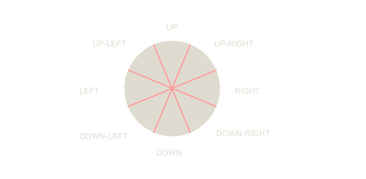
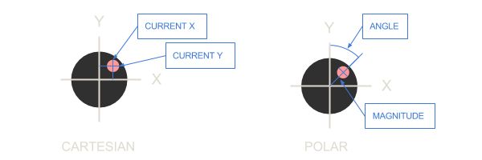

# Converting Thumbstick Input to Useful N-Directional Input

When developing a game, one of the major hurdles is converting information from input devices (whether mouse, keyboard, controller, or something else) into useful information that your game engine can use to update the game's state.

In this article, we are going to specifically focus on how to translate the typical information given by a controller's thumbsticks into more useable data.
<!-- more -->

## The Problem

Let's pretend that we are developing an adventure game called *Pete the Pirate*. In our game, we want our character Pete to be constrained to the 8 traditional directions as indicated in the image below. Pete can be facing in any of these 8 directions, and only these directions.  When he moves, he is locked to them, and when he swings his cutlass the hitbox will use his current facing direction for placement.


When using a keyboard, this system is easy to implement.  All we need to do is check which movement keys are pressed, and update Pete accordingly.  A snippet of our input code might look like this:

```csharp
void updateFacingDirection()
{
	if(UP.Pressed)
	{
		setFacing(UP);
	}
	else if(DOWN.Pressed)
	{
		setFacing(DOWN)
	}

	...

	if(UP.Pressed && LEFT.Pressed)
	{
		setFacing(UP-LEFT)
	}
}
```

Of course, there is nothing elegant or simple about this system -- but it works.

However, whereas keyboard inputs are *discrete*, the data from our controller's thumbsticks are *analog*. Each thumbstick records two floating point values, generally between -1.0f and 1.0f, which indicate the current value of the X and Y axes.  For instance, pulling the thumbstick to the far left would give an X-Axis value of -1.0f, and having the stick in the middle would give us 0.0f on the X-Axis, and 0.0f on the Y-Axis.

Updating our previous code for the controller might look like this:

```csharp
void updateFacingDirection()
{
	if(ThumbstickY > 0.0f)
	{
		setFacing(UP);
	}
	else if(ThumbstickY < 0.0f)
	{
		setFacing(DOWN)
	}

	...

	if(ThumbstickY > 0.0f && ThumbstickX < 0.0f)
	{
		setFacing(UP-LEFT)
	}
}
```

But what happens if the player isn't precise with their thumbstick control? Imagine pushing your thumbstick straight up.  In a perfect scenario, Pete would be set to the UP direction, and would walk upward.  But what if our thumbstick isn't perfectly straight up and our controller reads a Y-Axis value of 1.0f (straight up) and an X-Axis value of 0.02f (slightly to the right)?  Suddenly, Pete is set to the facing of UP-RIGHT, and walks the wrong direction!

When we treat thumbstick inputs as *discrete* inputs, it becomes very difficult for the player to put the thumbstick in a cardinal direction.  A vast majority of the time, they will find themselves moving along one of the diagonal directions!

Our intended behavior is that the 360-degrees of rotation for the thumbstick is treated as 8 separate 45-degree sectors. If the thumbstick is in the upper 45-degree sector (which spans 22.5 degrees on either side of straight up), Pete will face the UP direction.  If the thumbstick is in the next sector clock-wise (from 22.5 to 67.5), Pete will face the UP-RIGHT direction.  This is illustrated below.



But how to we convert our current thumbstick data into this more useful format?

## Step 1: Converting from Cartesian to Polar Coordinates

The first thing we have to do to correct this problem is to convert the X and Y values (which are Cartesian coordinates) into more useful ones.

Instead of an X and Y-Axes values, we want to know the angle from straight up that our thumbstick is facing, and the distance from the center that the thumbstick is pressed.  This, of course, is a Polar coordinate.



Luckily for us, there is no need to reinvent the wheel.  Mathematics provides the answer! Here is how to get this angle using C#.

```csharp
double getAngleFromXY(float XAxisValue, float YAxisValue)
{
	//Normally Atan2 takes Y,X, not X,Y.  We switch these around since we want 0
	// degrees to be straight up, not to the right like the unit circle;
	double angleInRadians = Math.Atan2(XAxisValue, YAXisValue);

	//Atan2 gives us a negative value for angles in the 3rd and 4th quadrants.
	// We want a full 360 degrees, so we will add 2 PI to negative values.
	if(angleInRadians < 0.0f) angleInRadians += (Math.PI * 2.0f);

	//Convert the radians to degrees.  Degrees are easier to visualize.
	double angleInDegrees = (180.0f * angleInRadians / Math.PI); 

	return angleInDegrees;
}
```

## Step 2: Converting our Angle to a Direction

Once we have our angle, converting that to a direction is actually very easy.  Here's the code:

```csharp
int convertXYtoDirection(float X, float Y)
{
	//We have 8 sectors, so get the size of each in degrees.
	double sectorSize = 360.0f / 8;

	//We also need the size of half a sector
	double halfSectorSize = sectorSize / 2.0f;

	//First, get the angle using the function above
	double thumbstickAngle = getAngleFromXY(X, Y);

	//Next, rotate our angle to match the offset of our sectors.
	double convertedAngle = thumbstickAngle + halfSectorSize;

	//Finally, we get the current direction by dividing the angle
	// by the size of the sectors
	int direction = (int)Math.Floor(convertedAngle / sectorSize);

	//the result directions map as follows:
	// 0 = UP, 1 = UP-RIGHT, 2 = RIGHT ... 7 = UP-LEFT.
	return direction;
}
```

Now our game engine is able to take raw controller thumbstick data and match those inputs to our 8 directions, and all it took was a few lines of math!

## More Fun

This method can also be used to map thumbstick data to any N facing directions.  All we need to do is change the number in our `convertXYtoDirection()` function to reflect how many sectors we have.  Keep in mind that sector 0 will always be evenly spaced around "UP".